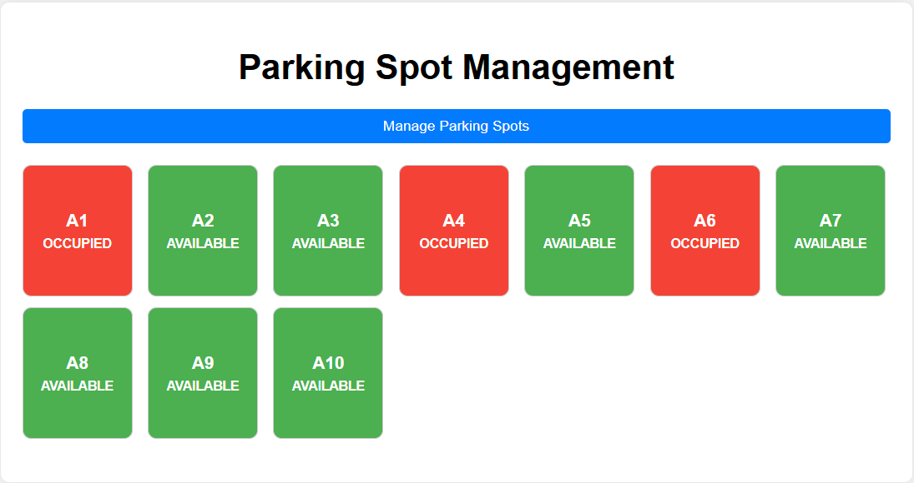

# Parking Spot Management System


 The Parking Spot Management System is a Spring Boot application designed to manage parking spots efficiently. It allows users to add, remove, park, and unpark vehicles in a simulated parking lot. This project is written in Java 21 and uses Spring Boot for the backend, H2 Database for data storage, and a simple frontend for interaction.



# Features
-   Add Parking Spots: Dynamically add new parking spots to the system.

-   Remove Parking Spots: Remove parking spots (only if they are unoccupied).

-   Park Vehicles: Park vehicles in available parking spots.

-   Unpark Vehicles: Unpark vehicles from occupied parking spots.

-   Real-Time Updates: The frontend dynamically updates to reflect changes in parking spot status.

-   H2 Database: Uses an embedded H2 database for data persistence.

-   Simple Frontend: A user-friendly interface built with HTML, CSS, and JavaScript.

# Technologies Used
-   Java 21: The core programming language.

-   Spring Boot: Backend framework for building RESTful APIs.

-   H2 Database: Embedded database for storing parking spot and vehicle data.

-   Gradle: Build automation tool for managing dependencies.

-   HTML/CSS/JavaScript: Frontend for user interaction.

# Prerequisites
Before running the project, ensure you have the following installed:

-   Java 21

-   Gradle

# Getting Started
Follow these steps to set up and run the project locally.

1. Clone the Repository
```
git clone https://github.com/whiteh4cker-tr/parking-spot-management.git
cd parking-spot-management
```

2. Build the Project
Use Gradle to build the project:
```
gradlew build
```

3. Run the Application
Run the application using the generated `.jar` file:
```
java -jar build/libs/parkingsystem-0.0.1-SNAPSHOT.jar
```

4. Access the Application
-   Open your browser and go to:
```
http://localhost:8080
```
-   Use the frontend to interact with the parking spot management system.

# Configuration
The application uses an H2 Database for data storage. The database file is created in the same directory as the application's `.jar` file. You can access the H2 console at:
```
http://localhost:8080/h2-console
```
-   JDBC URL: jdbc:h2:file:./parkingdb

-   Username: sa

-   Password: (leave blank)

API Endpoints
-------------

The following RESTful API endpoints are available:

-   **GET `/api/parking/spots`**: Get all parking spots.

-   **POST `/api/parking/park`**: Park a vehicle in a specific spot.

    -   Parameters:

        -   `spotNumber`: The parking spot number.

        -   Body: JSON object with `licensePlate` and `type`.

-   **POST `/api/parking/unpark`**: Unpark a vehicle from a specific spot.

    -   Parameters:

        -   `spotNumber`: The parking spot number.

-   **POST `/api/parking/spots/add`**: Add a new parking spot.

    -   Parameters:

        -   `spotNumber`: The parking spot number.

-   **DELETE `/api/parking/spots/remove`**: Remove a parking spot.

    -   Parameters:

        -   `spotNumber`: The parking spot number.